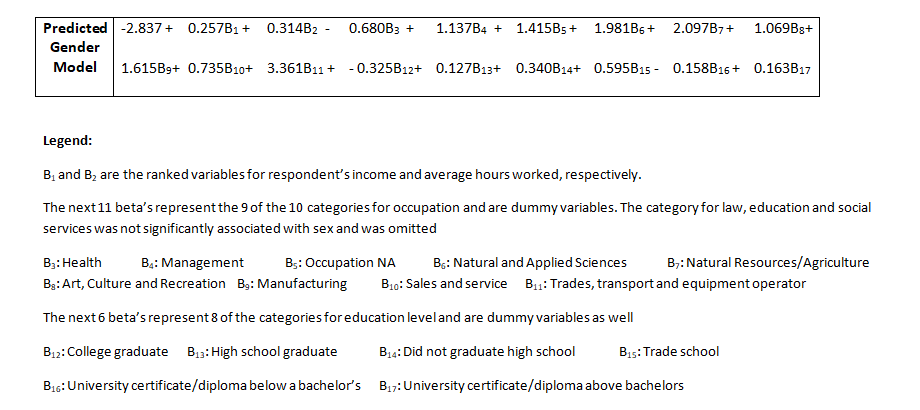

```{r setup, include=FALSE}
knitr::opts_chunk$set(echo = TRUE)
#install.packages('tidyverse')
#install.packages('rtools')
#install.packages('fastmatch')
library(fastmatch)
library(tidyverse)
gss <- read.csv("gss.csv")

```
## Abstract

  Inequality and sexism have historically shaped Canadian society and the lives of the many individuals who comprise it. Although contemporary Canada ranks well in terms of gender equality, there is still room for much improvement. We can quantify gender inequality by measuring the socioeconomic conditions of various men and women. Through our analysis of data gathered from the Canadian General Social Survey, our findings suggest that gender inequality persists within Canadian society with a major factor being the unequal participation of women in the workforce and within different occupations.
   
## Introduction

  Canada is a country that prides itself on having a high level of social equality between men and women. This is a justified belief in many regards, Canada ranks well among OECD countries in terms of gender equality in several key metrics such as workforce participation and higher education attainment (OECD, 2017). In more recent years, the federal government under Justin Trudeau has also positioned himself and his cabinet as a force to promote feminism within Canada as well as abroad (Gerster, 2019). However, this only emphasizes the fact that we must reflect upon the status of gender equality within Canada, especially when we continue to see shortcomings and inequality manifesting itself within different sectors of society. The following report seeks to provide an analysis of Canadian gender inequality by drawing upon data from the Canadian General Social Survey (GSS). We focus on socioeconomic indicators such as employment statistics and educational attainment to find correlations between an individual's sex and their quality of life. Based on our findings we propose a few areas of improvement that are necessary to close the gender gap in Canada.

## Data - Methodology

  The dataset we used for our analysis came from responses to Statistics Canada's General Social Survey (GSS). The survey currently has six themes that are cycled through approximately every five years. We decided to look at the survey conducted in 2017 on the theme of Family. The survey was conducted via telephone, specifically by random digit dialing in which phone numbers are generated randomly based on in-use area codes (the numbers generated were specifically for landlines). Respondents were assured confidentiality under the authority of the Statistics Act. Interviews were given until reaching a sample size of 25000 respondents. The dataset we specifically used was generously provided by UofT Prof. Alexander and had 20602 respondents after incomplete interviews were removed. 

  The target population of the study were citizens in Canada aged fifteen-plus living in private households. The sampling frame of the study was the list of randomly generated phone numbers. The telephone interviews were carried out with Computer Assisted Telephone Interviewing to lower costs. The random digit dialing method carried out allowed Statistics Canada to reach unlisted phone numbers, avoiding the problem of missing the demographic when using pre-existing telephone lists. However, their data collection method excludes cell phone only households and those without landlines. Therefore, certain demographics are less likely to be sampled like younger homeowners and lower income households respectively. The survey also overrepresented elderly citizens that are in retirement age due to the nature of having more spare time than a working individual and more willing to answer a 45 minute interview.  Conducting the survey via telephone also lowered response rates compared to a face-to-face interview and limited the questions that could be asked. 

## Data - Plots

```{r Age Groups, echo=FALSE}
#Plot demonstrating the skew in the average age of respondents
hist(gss$age, 
      main="Figure 1. Frequency of Canadian GSS Respondent Ages", 
      xlab="Age of Respondents", 
      border="white", 
      col="cadetblue4",
      cex.main=0.75)
```

  Figure 1 above demonstrates a right skew with the age distribution of respondents leaning to ages fifty-plus making up the majority. This can be explained due to the lower coverage of younger homeowners without landlines and overrepresentation of retirement aged individuals.

```{r money_stats, echo=FALSE}

#Rank data for logistic regression
avg_hrs_worked_rank = fmatch(gss$average_hours_worked, c("NA", "Don't know", "0.1 to 29.9 hours", "30.0 to 40.0 hours", "40.1 to 50.0 hours", "50.1 hours and more"))

income_family_rank = fmatch(gss$income_family, c("Less than $25,000", "$25,000 to $49,999", "$50,000 to $74,999", "$75,000 to $99,999", "$100,000 to $ 124,999", "$125,000 and more"))

income_respondent_rank = fmatch(gss$income_respondent, c("Less than $25,000", "$25,000 to $49,999", "$50,000 to $74,999", "$75,000 to $99,999", "$100,000 to $ 124,999", "$125,000 and more"))
```

  This figure showcasing the distribution of respondents' family income demonstrates non-coverage of lower income households lacking a landline. The median income of a family after taxes in Canada is $61 400 (Statistics Canada 2020), however our figure shows a significant portion of respondents reporting family incomes of over $125 000. 

  This figure modeling the distribution of respondents' individual income demonstrates a left skew leaning towards a low individual income in contrast to figure (replace with figure number of respondents' family income). This can be explained due to the overrepresentation of elderly individuals in retirement age that cause lower income responses to make up the majority while maintaining a high family income.
  
```{r filter, echo=FALSE}

# clean gss variables by sex
gss2 <-gss
gss2$sex<- ifelse(gss2$sex=="Male",1,0)
```


```{r female_occupation, echo=FALSE}

#Filter men/women into separate tables

fem <- filter(gss2, sex == 0)
men <- filter(gss2, sex == 1)

#Create Pie Chart of Female Occupations With Percentages
focc_table<-table(fem$occupation)
labels=c("Business and Finance", "Health", NA, "Management", "Sciences", "Resources/Agriculture", "Art, Culture, Recreation", "Social Work, Education, Law", "Manufacturing and Ultilities", "Sales or Service", "Trades, Transport", "Uncoded")
pct <- round(focc_table/sum(focc_table)*100)
occu_lbl<- paste(labels, pct)
occu_lbl <- paste(occu_lbl,"%",sep="")
pie(focc_table,labels = occu_lbl, col=rainbow(length(occu_lbl)), main="Figure 2.1: Careers Proportions of Female Respondents", radius = 1.0)

```

```{r male_occupation, echo=FALSE}
#Create Pie Chart of Male Occupations With Percentages
mocc_table<-table(men$occupation)
labels=c("Business and Finance", "Health", NA, "Management", "Sciences", "Resources/Agriculture", "Art, Culture, Recreation", "Social Work, Education, Law", "Manufacturing and Ultilities", "Sales or Service", "Trades, Transport", "Uncoded")
pctm <- round(mocc_table/sum(mocc_table)*100)
moccu_lbl<- paste(labels, pctm)
moccu_lbl <- paste(moccu_lbl,"%",sep="")
pie(mocc_table,labels = moccu_lbl, col=rainbow(length(moccu_lbl)), main="Figure 2.2: Careers Proportions of Male Respondents")

```
In figures Figure 2.1 and 2.2, we can see the occupation demographics for male and female respondents respectively. Statistics Canada grouped occupations into sectors and we used pie charts to easily display the differences in occupation sector percentages by gender.


```{r, echo=FALSE}

#Plot income
gss %>% 
  ggplot(aes(fill=sex, x=income_family)) +
  geom_bar(color = "black")+
  theme(axis.text.x=element_text(angle=90)) +
  labs(x="Family's Income",
       y="Frequency",
       title="Figure 3.1: Family's Income")

#Plot average hours worked
gss %>% 
  ggplot(aes(fill=sex, x=average_hours_worked)) +
  geom_bar(color = "black")+
  theme(axis.text.x=element_text(angle=90),panel.background = element_rect(fill = "lightblue", colour = "lightblue", size = 0.5, linetype = "solid")) +
  labs(x="Respondent's Average Hours Worked",
       y="Frequency",
       title="Figure 3.2: Respondent's Average Hours Worked")

#Plot income of respondents
gss %>% 
  ggplot(aes(fill=sex, x=income_respondent)) +
  geom_bar(color = "black")+
  theme(axis.text.x=element_text(angle=90),panel.background = element_rect(fill = "lightblue", colour = "lightblue", size = 0.5, linetype = "solid")) +
  labs(x="Respondent's Income",
       y="Frequency",
       title="Figure 3.3: Respondent's Income")
```

  Figure 3.1 showcasing the distribution of respondents' family income demonstrates non-coverage of lower income households lacking a landline. The median income of a family after taxes in Canada is $61 400 (Statistics Canada 2020), however our figure shows a significant portion of respondents reporting family incomes of over $125 000. 

  Figure 3.3 modeling the distribution of respondents' individual income demonstrates a left skew leaning towards a low individual income in contrast to figure (replace with figure number of respondents' family income). This can be explained due to the overrepresentation of elderly individuals in retirement age that cause lower income responses to make up the majority while maintaining a high family income.

```{r education graphs, echo=FALSE}
#Generate table of sex by education
gss3<- gss
gss3$sex<- ifelse(gss3$sex=="Male",1,0)
fem <- filter(gss3, sex == 0)
men <- filter(gss3, sex == 1)
men<-table(men$sex, men$education)
fem<-table(fem$sex, fem$education)
fem<-prop.table(fem)
men<-prop.table(men)

table <-rbind(fem,men)

#Set Table column names

colnames(table) <-c("BA/B.Sc.", "College", "HS Grad", " < HS", "Trades", "UBB", "UAB")

#Create grouped bar chart
barplot(table, 
        col=c("cadetblue3","cadetblue4") , 
        border="white", 
        font.axis=1, 
        beside=T, 
        legend=c("Female", "Male"),
        main="Figure 4.1 Education Levels of Respondents by Sex",
        ylab="Percentage of Respondents",
        xlab="Education Level", 
        font.lab=1)
```

Figure 4.1 suggests that sex related educational level differences occur in respondents. In particular, male respondents are more likely to be only highschool (HS) graduates, not complete HS (<HS), learn a trade (Trades) or attain a degree higher than a bachelor's while at university (UAB). Conversely, female respondents are more likely to graduate college or university with a bachelor's degree (BA/B.Sc), or a certificate or diploma lower than a bachelor's from a university (UBB). 


## Model

  A logistic model was used to model the data for our analysis of how sex affects one's socioeconomic status. Logistic models are generally used when trying to model the associations found between various independent variables and binary categorical dependent variables. Mathematically this takes the form of  we can express the probability 'p' that an individual is male as a logarithmic function of the various dependent variables.

$$log(\frac{p}{1 - p}) = \beta_0 + \beta_1x_1 + \beta_2x_2 + ... + \beta_kx_k$$

  This model is appropriate for our analysis since sex is a categorical variable and we would like to see how given information regarding an individual's socioeconomic conditions, if there is any bias towards their predicted sex. Assuming that there is little to no gender inequality, we expect to find that sex and socioeconomic status are independent. However, if we find that some socioeconomic factors are linked to sex, then we can infer that there is some element of bias within society that skews towards that result.

  For the purposes of our model, we chose several dependent variables such as income, educational attainment, and occupation that have historically been segregated strongly by sex. This data is categorical as a result of the survey methodology which was kept categorical for ease of aggregation. This unfortunately leads to some data points such as income (which would normally be quite continuous) as becoming categorical income ranges.

We fit our model using the built-in functions of R.

  Other potential models were considered for our analysis such as a Bayesian model as well as a classic linear model, but these were eliminated based on their weaknesses in appropriately modelling our data.

  We eliminated linear models as a possibility as they require that our response variable (the individual's sex) and the independent variables (varying socioeconomic factors) are linearly related. This also requires that the response variable be non-categorical which is clearly not the case for sex.

  Bayesian models require that we have information about the approximate distribution of the data (which we refer to as a prior) for the model. They are also best used when the prior is informative in some way as to the distribution that models the data. However since there are no clear trends from the GSS we cannot assume anything more than a uniform probability distribution for the distributions which is a non-informative prior. Thus, we do not use a Bayesian model.
  
## Results



The logistic regression model above is the result of fitting the model on the GSS data with the dependent variables listed above.

## Discussion

  Upon fitting the logistic model upon our data we find that there are several categories that positively correlate with classifying an individual being male. One key finding is that as an individual's average hours worked increases, the more likely it is that they will be male. This positive correlation actually outranks income category directly in predicting that a given individual is male. In this case we find that the coefficient associated with each level of income category is only 0.257 as opposed to the 0.314 with each additional level of average hours worked. This immediately suggests that although there may be a pay gap between men and women overall, the question that we should focus on is why women on average tend to work less hours than men.

  Although there are many reasons why there may be a reduced rate of labour force participation by women, a few have been suggested. Some of these include lack of adequate maternity/paternity leave and the unequal division of labour between paid and domestic work (Moyser 2017).

  In terms of occupation, we find that almost all occupation fields show an unequal gender distribution in favour of men. We find that the fields with the most unequal gender distributions are ones such as manufacturing, natural and applied sciences and art, as well as the trades. This suggests that in these fields, women are still heavily underrepresented. This lines up with (Wooton 1997). The ubiquity of this underrepresentation further provides evidence that there is in fact a gap in women's participation in paid labour. However, an exception to this is the field of 'healthcare' which suggests that women are actually overrepresented in the healthcare sector as opposed to men. This aligns with statistics that women make up around 87% of healthcare workers in Canada (Bourgeault 2018). 

  The final variable that we examined in depth was education. Although women have historically been barred or dissuaded from pursuing an education, we find from the GSS that great progress has been made in this regard. In particular, we find that an individual who holds a Bachelor's degree is more likely to be a woman than a man. However we do find that those holding graduate degrees are more likely to be men than women. At all other lower levels of educational attainment, it is more likely that any individuals with less or equivalent education to a secondary school diploma or trade school are men. This also matches with our analysis of male dominated labour sector as occupations within manufacturing and the trades often do not require post-secondary education.

  In conclusion, we find that the unequal participation of women within the paid workforce is a major shortcoming for Canada in terms of gender inequality. In order to close this gap, we should work to promote women's participation in sectors such as STEM but also in roles such as manufacturing and the trades.


## Weaknesses and Next Steps

  The survey method used to produce the data we used for our model had a number of flaws that created misrepresentations of certain demographics in Canada. An unavoidable consequence of a cost-restricted phone survey is the overrepresentation of elderly individuals in retirement age. With an average response rate of ten percent, it is evident the average working adult-with considerably less free time than a retired individual-would ignore a phone survey. Retired individuals however, would show a much higher response rate, being able to answer a forty minute interview at their leisure.

  Another issue with using a telephone survey that specifically targets landlines is non-coverage of individuals without landlines. This happens to be predominantly younger individuals living alone that use cell phones and lower income households without access to a landline.

  A third weakness with the telephone survey used by Statistics Canada is grouping data that should otherwise be continuous like income that can be easily recorded as such with a different method like an online survey. A weakness not necessarily specific to the survey method was handling of the data by interviewers and Statistics Canada. An arbitrary cap of eighty was set on the age of respondents that was unexplained by the bureau in any of their documents related to the response dataset.


  Promising next steps for further exploration is focusing on the gender wage gap highlighted by the results of our data analysis. Surveys conducted focusing on this topic should gather data on specific job occupations and record hours worked weekly and respondent income as continuous variables to be compared between genders. This will allow researchers to match hours worked and occupation between genders to compare individual income without confounding variables. These studies will also prevent maternal leave from influencing individual incomes and better elucidate if a true wage gap exists between two individuals with the same occupation but differing genders. 

  A second topic of interest for future studies is the gender difference in occupation sectors. Studies conducted should target younger individuals in high school and elementary and ask questions on which job sectors interest them the most and which they would avoid. The data should be divided by gender and analyzed for job occupation preference. These studies could inspire further research into why specific occupation sectors have differing gender demographics. 


## Appendix

*The code used in this report's analysis as well as the gss scripts necessary to clean the data can also be found at the GitHub tab linked on the blog header as well as at the following link: https://github.com/JinLong-Cao/Jin-Long-Cao-s-Statistical-Blog/tree/master/content/post*

*The gss.csv required for this analysis can be found at the following link http://www.chass.utoronto.ca/ although it is only accessible to UofT faculty, students, and staff*

## References

- Bourgeault, Ivy Lynn. (2018). "Women's work across every aspect of healthcare is largely invisible."  
   Evidence Network. Retrieved from: 
   http://evidencenetwork.ca/womens-work-across-every-aspect-of-healthcare-is-largely-invisible/. 

- Gerster, Jane, (2019). "How Much Did Feminist Trudeau Move the Needle on Gender Equality?" Global   
   News. Retrieved from: https://globalnews.ca/news/5887685/trudeau-feminism-equality/.  

- JJ Allaire et al. (2020). rmarkdown: Dynamic Documents for R. R package version 2.4. Retrieved from:
   https://rmarkdown.rstudio.com.

- Moyser, Barbara. (2017). "Women and Paid Work." Statistics Canada. Retrieved from:   
   https://www150.statcan.gc.ca/n1/pub/89-503-x/2015001/article/14694-eng.htm. 

- OECD. (2017). "The Pursuit of Gender Equality: An Uphill Battle." OECD Publishing, 
   Paris. Retrieved from: http://dx.doi.org/10.1787/9789264281318-en.

- R Core Team (2020). R: A language and environment for statistical computing. R
  Foundation for Statistical Computing, Vienna, Austria. URL
  https://www.R-project.org/.

- RStudio Team (2020). RStudio: Integrated Development for R. RStudio, PBC, Boston, MA Retrieved   
   from: http://www.rstudio.com/. 

- Simon Urbanek. (2017). fastmatch: Fast match() function. R package version 1.1-0.
   Retrieved from: https://CRAN.R-project.org/package=fastmatch. 

- Statistics Canada. (2020). "Canadian Income Survey, 2018." Retrieved from: 
   https://www150.statcan.gc.ca/n1/daily-quotidien/200224/dq200224a-eng.htm. 

- Wickham et al. (2019). Welcome to the tidyverse. Journal of Open Source Software, 4(43), 1686,
   Retrieved from: https://doi.org/10.21105/joss.01686. 

- Wickham, Hadley. (2016). ggplot2: Elegant Graphics for Data Analysis. Springer-Verlag New York.

- Wooton, Barbara. (1997). "Gender differences in occupational employment in occupational employment." 
   Monthly Labor Review 120(4):15-24. Retrieved from: https://stats.bls.gov/mlr/1997/04/art2full.pdf. 


